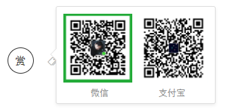

本项目旨在和大家一起交流学习如何使用php来搭建属于自己的API接口，任何问题请issues哦~

最近更新在2018/9/2日，新增皮皮虾短视频去水印api

(注：皮皮搞笑与皮皮虾是两个不同的APP)

### 预览地址：https://api.77sec.cn/

### 衍生项目：LanParse(蓝胖子)

它是一个Andorid应用，操作更加便捷~

更多请看：https://github.com/iqiqiya/LanParse

### API接口不断增加中...

> 1.[一言(古诗句版)](https://github.com/iqiqiya/iqiqiya-API/tree/master/yiyan)
>
> 2.[必应每日一图](https://github.com/iqiqiya/iqiqiya-API/tree/master/bing)
>
> 3.[在线ip查询](https://github.com/iqiqiya/iqiqiya-API/tree/master/ip)
>
> 4.[m3u8视频在线解析](https://github.com/iqiqiya/iqiqiya-API/tree/master/m3u8)
>
> 5.[随机生成二次元图片](https://github.com/iqiqiya/iqiqiya-API/tree/master/ACG)
>
> 6.[快递查询-支持国内百家快递](https://github.com/iqiqiya/iqiqiya-API/tree/master/kuaidi)
>
> 7.[flv视频在线解析](https://github.com/iqiqiya/iqiqiya-API/tree/master/flv)
>
> 8.[抖音无水印解析](https://github.com/iqiqiya/iqiqiya-API/tree/master/douyin)
>
> 9.[一句话随机图片](https://github.com/iqiqiya/iqiqiya-API/tree/master/RandPic)
>
> 10.[qq用户信息获取](https://github.com/iqiqiya/iqiqiya-API/tree/master/QQ)
>
> 11.[bilibili封面图获取](https://github.com/iqiqiya/iqiqiya-API/tree/master/bilibili)
>
> 12.[千图网(58pic)无水印解析](https://github.com/iqiqiya/iqiqiya-API/tree/master/58pic)
>
> 13.[喜马拉雅FM主播信息采集](https://github.com/iqiqiya/iqiqiya-API/tree/master/ximalaya)
>
> 14.[网易云音乐解析](https://github.com/iqiqiya/iqiqiya-API/tree/master/163music)
>
> 15.[CCTV(央视网)视频解析](https://github.com/iqiqiya/iqiqiya-API/tree/master/cctv)
>
> 16.[微信运动步数修改](https://github.com/iqiqiya/iqiqiya-API/tree/master/WeChat)
>
> 17.[皮皮搞笑APP无水印视频解析](https://github.com/iqiqiya/iqiqiya-API/tree/master/PiPiGaoXiao)
> 
> 18.[皮皮虾短视频无水印解析](https://github.com/iqiqiya/iqiqiya-API/tree/master/PiPiXia)
>
> 有的是搜集的有的是自写的（有注明哦）
>
> 如果对你有帮助，给个star呗，谢啦
>
> [窝很饿，请我吃辣条](https://api.77sec.cn/Donate.png)

